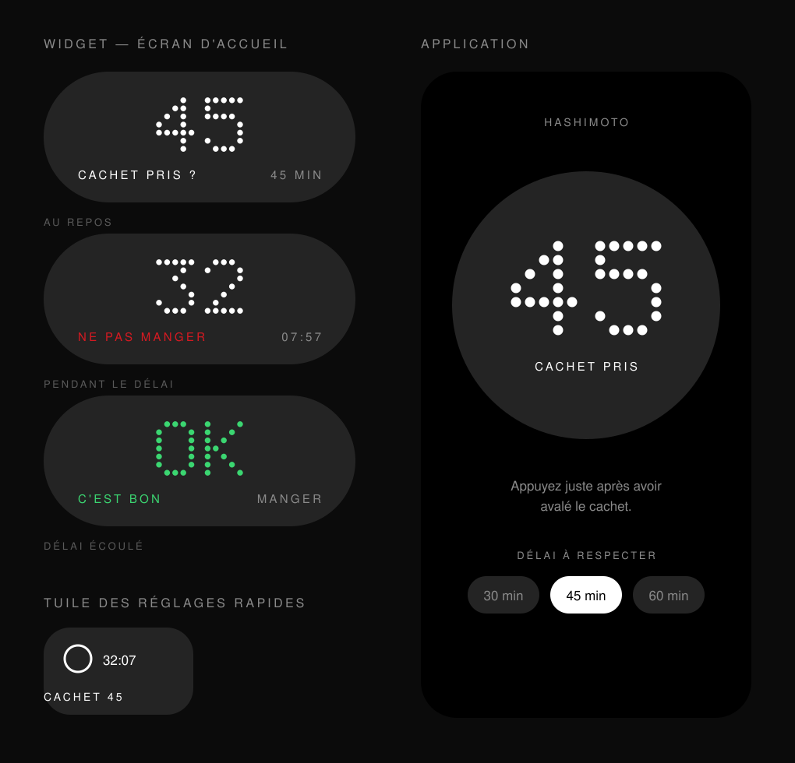

# Cachet 45

Minuteur d'un seul appui pour le traitement de l'hypothyroïdie (Hashimoto) :
on prend le cachet le matin, on appuie sur le widget, et l'application prévient
quand le délai de jeûne est écoulé et qu'on peut enfin manger et boire.

Pensé pour Nothing OS (CMF Phone 2 Pro), dans le style maison : pilules
anthracite, gros chiffres en matrice de points, petites capitales espacées.



## Ce que ça fait

- **Un appui sur le widget** = le minuteur démarre. Rien d'autre à faire.
- Le widget affiche les **minutes restantes** et **l'heure à laquelle vous pourrez manger**.
- Une notification silencieuse décompte dans la barre d'état.
- À la fin : **sonnerie d'alarme + vibration**, « C'est bon, vous pouvez manger ».
- Délai réglable : 30, 45 ou 60 minutes (45 par défaut).
- Le minuteur survit au redémarrage du téléphone et à la veille profonde.

### Trois façons de lancer le minuteur, toutes en un geste

| Où | Comment |
| --- | --- |
| Widget de l'écran d'accueil | un appui sur la pilule |
| Réglages rapides | volet déroulant → tuile « Cachet 45 » |
| Icône de l'appli | appui long → « Démarrer » |

Pendant le décompte, un appui sur le widget ouvre l'appli, d'où l'on peut
annuler. Le minuteur ne peut donc pas être remis à zéro par erreur.

## Installer sur le téléphone

1. Ouvrir, **depuis le téléphone**, la page
   [Releases](../../releases/tag/derniere-version) du dépôt.
2. Télécharger `cachet45.apk`.
3. Ouvrir le fichier téléchargé et autoriser l'installation depuis cette source.
4. Au premier lancement, accepter les notifications, puis appuyer sur
   **« Ajouter le widget à l'écran d'accueil »**.

L'APK est reconstruit automatiquement à chaque modification du code
(onglet **Actions** du dépôt).

> **Si l'onglet Actions affiche « startup_failure » sans aucun job :** c'est que
> le dépôt est privé. Sur un dépôt privé, GitHub facture les minutes
> d'exécution, et rien ne démarre s'il n'en reste plus. Le plus simple est de
> passer le dépôt en public (Settings → General → Change visibility), où Actions
> est gratuit et illimité. À défaut, il reste la compilation locale ci-dessous.

### Sans passer par GitHub

Ouvrir le dossier dans **Android Studio** puis lancer *Run* sur le téléphone
branché en USB (débogage USB activé). Android Studio télécharge seul le SDK
nécessaire.

## Fonctionnement interne

Volontairement sans service en arrière-plan ni thread : le décompte est
entièrement porté par l'horloge système.

- `Minuteur` — démarrage, annulation, fin. L'échéance est posée avec
  `AlarmManager.setAlarmClock()`, la seule variante qu'Android ne repousse
  jamais, même en veille profonde ou en économie d'énergie.
- `Reglages` — l'état tient dans quatre valeurs (`SharedPreferences`) : début,
  fin, durée choisie, dernière prise. L'état courant se déduit de l'heure de fin
  comparée à l'heure actuelle, donc rien ne peut se désynchroniser.
- `Matrice` / `VueMatrice` — les chiffres en points. La police NDot de Nothing
  n'étant pas redistribuable, chaque glyphe est dessiné sur une grille de 5×7
  vrais cercles, réutilisée pour le widget (bitmap), l'écran principal (canvas)
  et l'icône de l'appli (vecteur généré).
- `MinuteurWidget` — le widget affiche des minutes, il est donc redessiné une
  fois par minute seulement, via une alarme qui se replanifie toute seule.
- `DemarrageReceiver` — repose l'alarme après un redémarrage du téléphone, une
  mise à jour de l'appli ou un changement d'heure.

## Compiler soi-même

```bash
./gradlew assembleRelease   # app/build/outputs/apk/release/app-release.apk
```

Il faut un SDK Android (API 35) et un JDK 17.

## Avertissement

Cette application est un minuteur, pas un dispositif médical. Le délai à
respecter entre la prise du cachet et le premier repas est celui que vous a
indiqué votre médecin ou votre pharmacien.
